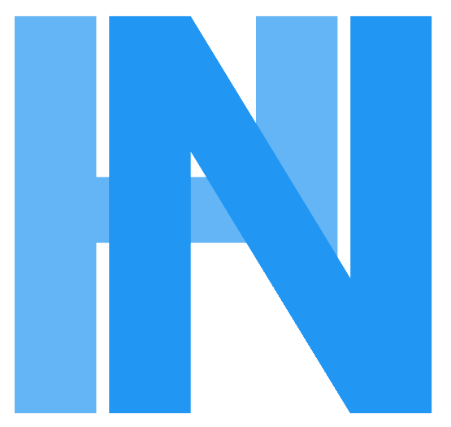

# Portfolio

<div align="center">
  <br />
  
  <br />
</div>


## Cahier des charges:

1. [Description](#-description)
2. [Fonctionnalités](#-fonctionnalités)
3. [Public cible](#️️-public-cible)
4. [Technologies Utilisées](#️-technologies-utilisées)
5. [Charte Graphique détaillée](#-charte-graphique-détaillée)
6. [Responsive Design](#-responsive-design)
7. [Charte Graphique - Image](#-charte-graphique---image)
8. [Use Case](#-use-case)
9. [Wireframe](#wireframe)
10. [Maquettage](#maquettage)

## 📋 Description

Ce portfolio est une vitrine de mes compétences et réalisations en tant qu'étudiant en cybersécurité à l'ESIEA Laval. Il a été conçu pour présenter mon parcours professionnel de manière claire et interactive.

## 🎯 Fonctionnalités

- 🏠 Page d'accueil avec présentation personnelle
- 📝 Formulaire de contact interactif
- 📄 Téléchargement de CV
- 🔗 Liens vers profils professionnels (LinkedIn, GitHub)

## 🕵️‍♂️ Public cible

- Entreprises et recruteurs dans le domaine de la cybersécurité
- Professionnels du secteur pour d'éventuelles collaborations
- Communauté tech et cybersécurité
- Autres étudiants et passionnés du domaine

## 🛠️ Technologies Utilisées

- HTML5 sémantique
- CSS3 avec animations
- Bootstrap 5
- JavaScript
- Google Fonts (Montserrat & Roboto)

## 🎨 Charte Graphique détaillée

### Couleurs
```css
:root {
    --primary-color: #1a1a1a;    /* Fond principal */
    --secondary-color: #2196F3;   /* Bleu principal */
    --accent-color: #64B5F6;      /* Bleu clair */
    --text-color: #ffffff;        /* Texte */
    --dark-bg: #121212;          /* Background sombre */
    --card-bg: #1E1E1E;          /* Cartes */
}
```

### Typographie

- **Titres** : Montserrat (400, 500, 600, 700)
- **Corps** : Roboto (300, 400, 500)

## 📱 Responsive Design

Le site est entièrement responsive avec une approche mobile-first :
- Adaptation automatique sur mobiles, tablettes et desktop
- Menu de navigation adaptatif
- Images et contenus redimensionnables

## 🎨 Charte Graphique - Image


## 📋 Use Case

## Wireframe

## Maquettage


